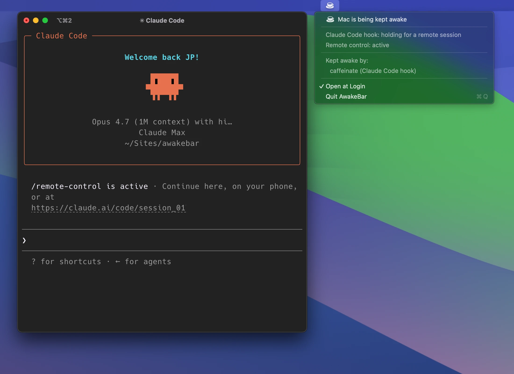

# AwakeBar

A tiny macOS menu bar app that shows, at a glance, whether something is
deliberately keeping your Mac awake — with first-class awareness of the
Claude Code CLI.



## What it shows

A coffee cup in the menu bar:

- **☕ filled** — something is holding a system-sleep assertion
- **💤 empty** — the Mac can sleep normally

The dropdown lists the responsible processes and always shows a dedicated
**Claude Code hook** line — `Claude is working` during a turn,
`holding for a remote session` when a Remote Control session keeps the Mac
awake between turns, `idle (last active 30s ago)` otherwise — plus a live
**Remote control** line:

```
☕ Mac is being kept awake
──────────────
Claude Code hook: holding for a remote session
Remote control: active
──────────────
Kept awake by:
   caffeinate (Claude Code hook)
──────────────
Open at Login
Quit AwakeBar
```

State comes from `pmset -g assertions`, so it reflects the *whole system* —
unlike KeepingYouAwake or Amphetamine, whose icon only tracks their own
assertion. It counts the three assertion types that keep the *machine* awake
(`PreventUserIdleSystemSleep`, `PreventSystemSleep`, and the
`NoIdleSleepAssertion` that Electron's `powerSaveBlocker` registers — e.g.
Claude Desktop's own keep-awake). Ambient daemons (`powerd`, `bluetoothd`,
`sharingd`) are filtered out so a filled cup means something deliberate.

AwakeBar is mostly an *observer* — it reads the system's assertions rather than
creating them. The one exception is Remote Control: while a bridge is connected
it holds its own `PreventUserIdleSystemSleep` assertion (named *"AwakeBar:
Remote Control session connected"*), so a session driven from claude.ai / mobile
can't be dropped by idle sleep in the gap between turns when the keep-awake hook
isn't holding one. That assertion is filtered out of AwakeBar's own holder list
(so it never circularly lists itself) and surfaced instead as **Kept awake by:
AwakeBar (Remote Control session)**.

## Build & install

Requires macOS 15+ and Swift 6.2.

```sh
./build.sh
```

Builds and signs `AwakeBar.app`. For the first install, drag it to
`/Applications`, open it, and pick **Open at Login** from its menu — it lives
only in the menu bar, no Dock icon. After that, `./build.sh` keeps the
installed copy in sync on every rebuild.

## The Claude Code hook (optional)

`keep-awake.sh` is the paired Claude Code hook: it runs a `caffeinate` while
Claude is working and stops when the turn ends — and for a **Remote Control**
session it keeps the Mac awake *between* turns too, so a session driven from
claude.ai or mobile isn't killed by the Mac sleeping. Install it by copying
the script to `~/.claude/` (and `chmod +x` it), then wiring it into
`~/.claude/settings.json`:

```json
{
  "hooks": {
    "SessionStart":    [{ "hooks": [{ "type": "command", "command": "~/.claude/keep-awake.sh", "async": true }] }],
    "UserPromptSubmit": [{ "hooks": [{ "type": "command", "command": "~/.claude/keep-awake.sh" }] }],
    "Stop":            [{ "hooks": [{ "type": "command", "command": "~/.claude/keep-awake.sh" }] }],
    "SessionEnd":      [{ "hooks": [{ "type": "command", "command": "~/.claude/keep-awake.sh" }] }]
  }
}
```

`SessionStart` is wired `async` so a Remote Control session is held from the
moment it connects, not just from the first turn. While caffeinate runs the
hook records *why* in `/tmp/claude-keep-awake.reason` (`turn` or `remote`),
which is what drives the **Claude Code hook** line's wording.

The app and the hook are independent — the app works on its own; the hook is
what makes the **Claude Code hook** line light up.

### How Remote Control is detected

Claude Code no longer records Remote Control state in a file AwakeBar can read
(the old `~/.claude/sessions/<pid>.json` `bridgeSessionId` field is gone), and
the bridge multiplexes over the same TLS as normal inference, so it can't be
spotted from sockets either. Both the app and the hook fall back to the only
on-disk trace: the bridge **lifecycle** logged by Claude Code's VSCode
extension-host log, trusting the last connect/teardown marker. This is
best-effort — it works for **VSCode-hosted** sessions running with `--debug`
(the extension's default), and reads as "off" for pure-terminal sessions. The
marker strings are centralised in both `main.swift` and `keep-awake.sh` so a
Claude Code rename is a one-line fix.

The app goes one step further and **lists which project** each connected
session is driving: the same log records the session's `cwd` (in its
`launch_claude` / `Spawning Claude` lines), so the menu shows the folder name
under **Remote control: active**. The cwd parse is anchored to those two
authoritative line shapes — the log also echoes back tool inputs (e.g. bash
commands you run), which can mention `cwd:` and must not be mistaken for the
real one. Granularity is per-window/per-project, not per-pid (one window
normally drives one session); if the launch line has scrolled out of the log
tail the entry falls back to a generic "Claude session".
