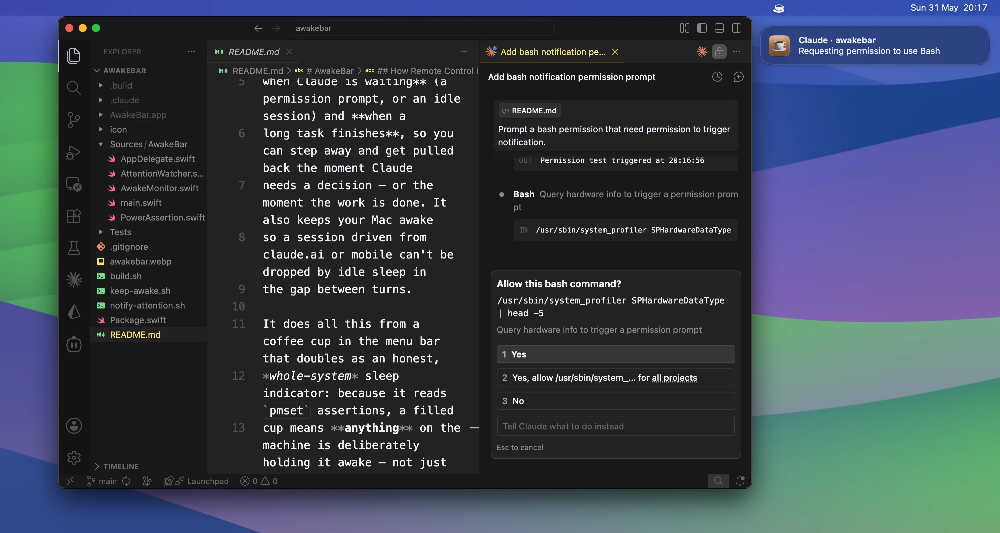

# AwakeBar

A tiny macOS menu bar app that keeps your Claude Code sessions from being
interrupted — and pulls *you* back the moment they need you. It **notifies you
when Claude is waiting** (a permission prompt, or an idle session) and **when a
long task finishes**, so you can step away and get pulled back the moment Claude
needs a decision — or the moment the work is done. It also keeps your Mac awake
so a session driven from claude.ai or mobile can't be dropped by idle sleep in
the gap between turns.

It does all this from a coffee cup in the menu bar that doubles as an honest,
*whole-system* sleep indicator: because it reads `pmset` assertions, a filled
cup means **anything** on the machine is deliberately holding it awake — not just
AwakeBar's own hold, unlike KeepingYouAwake or Amphetamine.



## What it shows

A coffee cup in the menu bar:

- **☕ filled** — something is holding a system-sleep assertion
- **○ empty** — the Mac can sleep normally

The dropdown opens with a headline (**Mac is being kept awake** / **Mac can
sleep normally**) and two live status lines:

- a dedicated **Claude Code Hook** line — `Claude is working` during a turn,
  `holding for a remote session` between turns of a Remote Control session,
  `idle (last active 30s ago)` otherwise, or `not installed`;
- a **Remote Control** line — `Active` (with each connected project listed
  beneath it), `idle (sleep allowed)` once the idle timeout has released the
  hold, or `Off`.

When the Mac is awake, a **Kept Awake By** submenu lists exactly what's
responsible. Turning on **Show Plan Usage** adds a **Plan Usage** section
([below](#plan-usage)). Then the controls:

```
☕ Mac is being kept awake
──────────────
● Claude Code Hook: holding for a remote session
● Remote Control: Active
     awakebar
     maru
  Kept Awake By    ▸
──────────────
↗ Max (5x) Plan Usage              Resets
◑ Session: 53%                   in 2h 34m
◑ Weekly: 23%                    Sat 07:00
○ Weekly · Sonnet: 0%
──────────────
   Force Stay Awake
✓ Notify When Task Finishes
✓ Clear Notifications When Resumed
   Notification Delay     ▸
   Remote Idle Timeout    ▸
✓ Show Plan Usage
✓ Open at Login
──────────────
⏻ Quit AwakeBar
```

The controls are **Force Stay Awake** (a manual hold that red-badges the cup),
**Notify When Task Finishes**, **Clear Notifications When Resumed**,
**Notification Delay**, **Remote Idle Timeout**, **Show Plan Usage**, **Open at
Login**, and **Quit**.

## Notifications

AwakeBar posts a native macOS notification in two cases, both riding Claude
Code's hooks:

- **Claude needs you** — a permission prompt, or a session idle for ≥60s. Titled
  `Claude · <project>` so concurrent sessions are distinguishable, and deferred
  by a short grace period (the **Notification Delay** menu — 5 or 10 s, default
  10) so it only fires once you've actually stepped away. Clicking the banner
  brings VSCode forward. Works for terminal sessions and VSCode in-panel prompts.
- **A task finished** — when a turn ran at least 30 s, so quick conversational
  replies stay quiet. Gated on turn length, *not* on whether you're at the
  keyboard, so it fires whatever window you're in. Toggle with **Notify When
  Task Finishes**.

When **Clear Notifications When Resumed** is on (the default), a delivered alert
is withdrawn from Notification Center once that session starts running again, so
a stale banner doesn't linger after you've answered.

The first notification prompts macOS for permission; turn the feature off by
removing the hooks or via **System Settings ▸ Notifications**. See
[DESIGN.md](DESIGN.md) for how the deferral, dedup, and VSCode-log path work.

## Plan usage

Turn on **Show Plan Usage** to mirror Claude Code's `/usage` screen in the menu —
how much of your plan you've burned and when each window resets:

- **Session** — your 5-hour rolling window (e.g. `53% · in 2h 34m`).
- **Weekly** — the all-models weekly limit (e.g. `23% · Sat 07:00`), plus a
  per-model row (e.g. **Weekly · Sonnet**) when you've used that model.

Each row carries a small pie that fills as the window does and **turns red past
75%**, so a glance tells you how close you are. The header names your plan
(**Max (5x) Plan Usage**) and links to your usage page on the web.

Reset times follow your Mac's clock format (12-/24-hour) and locale. The numbers
update on a slow cadence — this is a glance, not a live dashboard.

**Off by default**, because it reads data the others don't: it reuses your
existing Claude Code login (the OAuth token in your Keychain) to fetch usage
straight from Anthropic, so the first time you enable it macOS asks you to allow
access to the `Claude Code-credentials` keychain item — click **Always Allow**.
It's read-only, polls infrequently, and spends no message quota; the token never
leaves your Mac. This uses an undocumented Claude Code interface, so it may need
an update if Anthropic changes it — see [DESIGN.md](DESIGN.md).

## Install the hooks

The app works on its own, but two optional Claude Code hooks light up its full
behavior. Copy all three files to `~/.claude/` and `chmod +x` the two hooks:

- `notify-attention.sh` — drives the notifications above.
- `keep-awake.sh` — runs `caffeinate` while Claude works (and between turns for a
  Remote Control session, so a claude.ai / mobile session isn't dropped by idle
  sleep), and lights up the **Claude Code Hook** menu line.
- `claude-hook-contract.sh` — shared definitions both hooks source (the marker
  paths, bridge markers, and reason tokens, mirroring the app's `Contract.swift`).
  Not a hook itself; it must sit beside the two scripts in `~/.claude/`.

Then wire them into `~/.claude/settings.json`:

```json
{
  "hooks": {
    "SessionStart":     [{ "hooks": [{ "type": "command", "command": "~/.claude/keep-awake.sh", "async": true }] }],
    "UserPromptSubmit": [{ "hooks": [{ "type": "command", "command": "~/.claude/keep-awake.sh" }, { "type": "command", "command": "~/.claude/notify-attention.sh" }] }],
    "PostToolUse":      [{ "hooks": [{ "type": "command", "command": "~/.claude/notify-attention.sh" }] }],
    "Notification":     [{ "hooks": [{ "type": "command", "command": "~/.claude/notify-attention.sh" }] }],
    "Stop":             [{ "hooks": [{ "type": "command", "command": "~/.claude/keep-awake.sh" }, { "type": "command", "command": "~/.claude/notify-attention.sh" }] }],
    "SessionEnd":       [{ "hooks": [{ "type": "command", "command": "~/.claude/keep-awake.sh" }] }]
  }
}
```

See [DESIGN.md](DESIGN.md) for what each event does, the between-turns hold, and
the **Remote Idle Timeout** that caps an abandoned remote session.

## Build & install

Requires macOS 15+ and Swift 6.2.

```sh
./build.sh
```

Builds and signs `AwakeBar.app`. For the first install, drag it to
`/Applications`, open it, and pick **Open at Login** from its menu — it lives
only in the menu bar, no Dock icon. After that, `./build.sh` keeps the installed
copy in sync on every rebuild. `swift test` runs the parser unit tests.

Source lives in `Sources/AwakeBar/` (one file per type) and the icon in `icon/`;
see [CLAUDE.md](CLAUDE.md) for the source map and contributor notes. The
mechanics and design rationale behind every feature above are in
[DESIGN.md](DESIGN.md).
